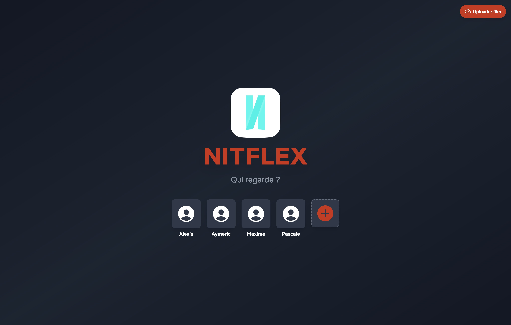
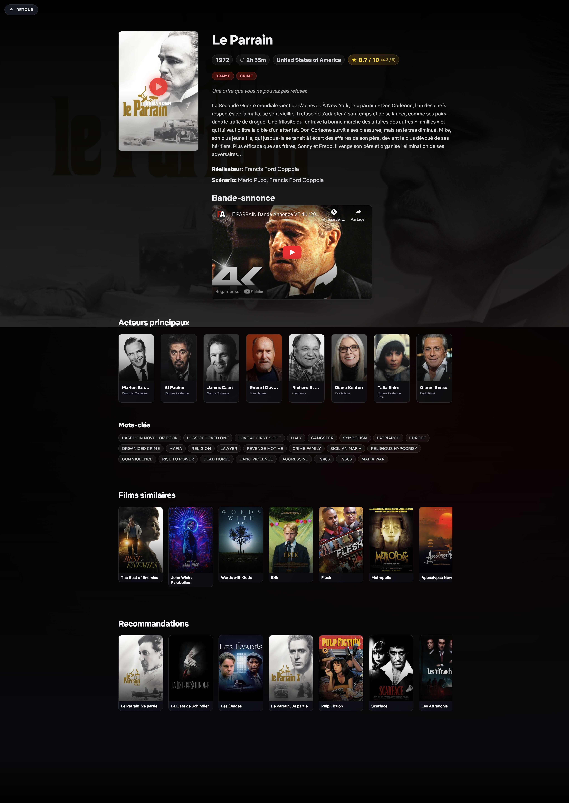

# 🎬 Nitflex

**Nitflex** is a private streaming platform for managing and watching films stored on a NAS server. This project is a complete application featuring a modern React frontend, a Go backend API, and MongoDB for data persistence.

> ⚠️ **Disclaimer**: This software is not inspired by the well-known application Netflix. Any resemblance or similarity is purely coincidental.

# Installation

### 1. Clone the repository:
```bash
git clone https://github.com/AdlarX9/nitflex.git
```
```bash
cd nitflex
```

### 2. Configure rights:
```bash
chmod +x ./nitflex.sh
```
```bash
cp .env.example .env
```

Then edit the `.env` file with your own settings.

### 3. Start the application:

Production mode:
```bash
./nitflex.sh deploy
```

Development mode:
```bash
./nitflex.sh dev
```

### 4. Access the application:

Open your browser at `http://localhost`.

# Screenshots

> 
> Home page to choose your account

> 
> Explorer page to watch your recently acquired movies

> 
> Import page to add a new movie to the Data Base

> 
> Search page to search for a movie

> 
> The details of a movie
